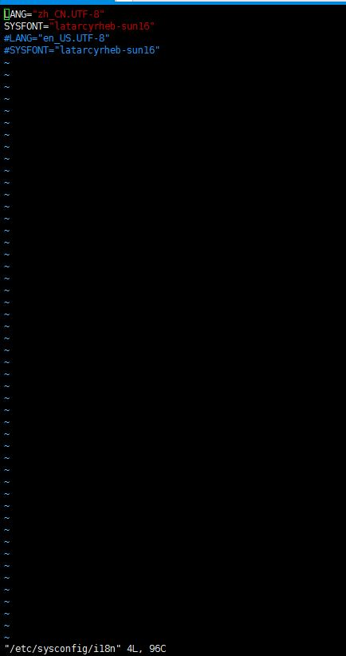

#Linux线上排查程序员实用指令

#**一、乱码问题**
##**1. Linux系统编码**
>有时候你会发现linux系统打印出来的文字是乱码，一般是要么是你连接Linux的中断编码有问题，或者是linux系统编码设置不对

(1)执行locale命令查看系统语言
```shell
[root@localhost /]# locale
LANG=zh_CN.GBK
LC_CTYPE="zh_CN.GBK"
LC_NUMERIC="zh_CN.GBK"
LC_TIME="zh_CN.GBK"
LC_COLLATE="zh_CN.GBK"
LC_MONETARY="zh_CN.GBK"
LC_MESSAGES="zh_CN.GBK"
LC_PAPER="zh_CN.GBK"
LC_NAME="zh_CN.GBK"
LC_ADDRESS="zh_CN.GBK"
LC_TELEPHONE="zh_CN.GBK"
LC_MEASUREMENT="zh_CN.GBK"
LC_IDENTIFICATION="zh_CN.GBK"
LC_ALL=

```
（2）通过以下指令把系统环境变量LANG设置为en_US.UTF-8
```shell
export LANG=en_US.UTF-8 
```
效果如下:
```shell
[root@localhost /]# export LANG=en_US.UTF-8
[root@localhost /]# locale
LANG=en_US.UTF-8
LC_CTYPE="en_US.UTF-8"
LC_NUMERIC="en_US.UTF-8"
LC_TIME="en_US.UTF-8"
LC_COLLATE="en_US.UTF-8"
LC_MONETARY="en_US.UTF-8"
LC_MESSAGES="en_US.UTF-8"
LC_PAPER="en_US.UTF-8"
LC_NAME="en_US.UTF-8"
LC_ADDRESS="en_US.UTF-8"
LC_TELEPHONE="en_US.UTF-8"
LC_MEASUREMENT="en_US.UTF-8"
LC_IDENTIFICATION="en_US.UTF-8"
LC_ALL=
[root@localhost /]# tail 
```
也可以更改/etc/sysconfig/i18n去设置
```shell
vim /etc/sysconfig/i18n
```


#**二、帮助指令**
>很多日常生活中有跟linux打交道过的童学都知道，linux指令参数很多，不知道怎么去记，以下就介绍怎样利用Linux的帮助指令来提高我们工作效率

##**1. help命令**
help命令用于显示***shell内部***命令的帮助信息。help命令只能显示shell内部的命令帮助信息。而对于外部命令的帮助信息只能使用man或者info命令查看
**语法**
```text 
help(选项)(参数)
```
**选项**
```text
-s：输出短格式的帮助信息。仅包括命令格式。
```
**参数**
```text
内部命令：指定需要显示帮助信息的shell内部命令。
```
**实例**
使用help命令显示shell内部cd命令的帮助信息，输入如下命令：
```shell
[root@localhost apache-tomcat-9.0.0.M20]# help cd
cd: cd [-L|-P] [dir]
    Change the shell working directory.
    
    Change the current directory to DIR.  The default DIR is the value of the
    HOME shell variable.
    
    The variable CDPATH defines the search path for the directory containing
    DIR.  Alternative directory names in CDPATH are separated by a colon (:).
    A null directory name is the same as the current directory.  If DIR begins
    with a slash (/), then CDPATH is not used.
    
    If the directory is not found, and the shell option `cdable_vars' is set,
    the word is assumed to be  a variable name.  If that variable has a value,
    its value is used for DIR.
    
    Options:
        -L	force symbolic links to be followed
        -P	use the physical directory structure without following symbolic
    	links
    
    The default is to follow symbolic links, as if `-L' were specified.
    
    Exit Status:
    Returns 0 if the directory is changed; non-zero otherwise.

```
##**2. man命令**
man命令是Linux下的帮助指令，通过man指令可以查看Linux中的指令帮助、配置文件帮助和编程帮助等信息。

**语法**
```text
man(选项)(参数)
```
**选项**
```text
-a：在所有的man帮助手册中搜索；
-f：等价于whatis指令，显示给定关键字的简短描述信息；
-P：指定内容时使用分页程序；
-M：指定man手册搜索的路径。
```
**参数**
- 数字：指定从哪本man手册中搜索帮助；
- 关键字：指定要搜索帮助的关键字。

**实例**
我们输入man ls，它会在最左上角显示“LS（1）”，在这里，“LS”表示手册名称，而“（1）”表示该手册位于第一节章，同样，我们输man ifconfig它会在最左上角显示“IFCONFIG（8）”。也可以这样输入命令：“man [章节号] 手册名称”。

man是按照手册的章节号的顺序进行搜索的，比如：
```shell
man ls
```
执行结果如下：
```shell
NAME
       ls - list directory contents

SYNOPSIS
       ls [OPTION]... [FILE]...

DESCRIPTION
       List information about the FILEs (the current directory by default).  Sort entries alphabetically if none of -cftuvSUX nor --sort.

       Mandatory arguments to long options are mandatory for short options too.

       -a, --all
              do not ignore entries starting with .

       -A, --almost-all
              do not list implied . and ..

       --author
              with -l, print the author of each file

       -b, --escape
              print octal escapes for nongraphic characters

       --block-size=SIZE
              use SIZE-byte blocks.  See SIZE format below

       -B, --ignore-backups
              do not list implied entries ending with ~

       -c     with -lt: sort by, and show, ctime (time of last modification of file status information) with -l: show ctime and sort by name otherwise: sort by ctime

       -C     list entries by columns

       --color[=WHEN]
              colorize the output.  WHEN defaults to ‘always’ or can be ‘never’ or ‘auto’.  More info below

       -d, --directory
              list directory entries instead of contents, and do not dereference symbolic links

       -D, --dired
              generate output designed for Emacs’ dired mode

       -f     do not sort, enable -aU, disable -ls --color

       -F, --classify
              append indicator (one of */=>@|) to entries

       --file-type
              likewise, except do not append ‘*’

       --format=WORD

```
只会显示sleep命令的手册,如果想查看查看命令拥有哪个级别的帮助,则使用
```text
man -f 命令 
```
执行效果如下：
```shell
[root@localhost apache-tomcat-9.0.0.M20]# man -f ls
ls                   (1)  - list directory contents
```
```shell
[root@localhost apache-tomcat-9.0.0.M20]# man -f ifconfig
ifconfig             (8)  - configure a network interface

```
man的级别如下：
- 1 : 查看命令的帮助-
- 2 : 查看可被内核调用的函数的帮助-
- 3 : 查看函数和函数库的帮助-
- 4 : 查看特殊文件的帮助(主要是/dev目录下的文件)-
- 5 : 查看配置文件的帮助-
- 6 : 查看游戏的帮助-
- 7 : 查看其他杂项的帮助-
- 8 : 查看系统管理员可用命令的帮助-
- 9 : 查看和内核相关文件的帮助

##**3. info命令**
info命令是Linux下info格式的帮助指令。

就内容来说，info页面比man page编写得要更好、更容易理解，也更友好，但man page使用起来确实要更容易得多。一个man page只有一页，而info页面几乎总是将它们的内容组织成多个区段（称为节点），每个区段也可能包含子区段（称为子节点）。理解这个命令的窍门就是不仅要学习如何在单独的Info页面中浏览导航，还要学习如何在节点和子节点之间切换。可能刚开始会一时很难在info页面的节点之间移动和找到你要的东西，真是具有讽刺意味：原本以为对于新手来说，某个东西比man命令会更好些，但实际上学习和使用起来更困难。

**语法**
```text
info(选项)(参数)
```
**选项**
```text
-d：添加包含info格式帮助文档的目录；
-f：指定要读取的info格式的帮助文档；
-n：指定首先访问的info帮助文件的节点；
-o：输出被选择的节点内容到指定文件。
```
**参数**
帮助主题：指定需要获得帮助的主题，可以是指令、函数以及配置文件。

**实例**
在info后面输入命令的名称就可以查看该命令的info帮助文档了：
```text
info mkdir
```

**常用快捷键**
```text
?键：它就会显示info的常用快捷键。
N键：显示（相对于本节点的）下一节点的文档内容。
P键：显示（相对于本节点的）前一节点的文档内容。
U键：进入当前命令所在的主题。
M键：敲M键后输入命令的名称就可以查看该命令的帮助文档了。
G键：敲G键后输入主题名称，进入该主题。
L键：回到上一个访问的页面。
SPACE键：向前滚动一页。
BACKUP或DEL键：向后滚动一页。
Q：退出info。
```
**命令**
```text
？     显示帮助窗口

在帮助窗口中：
Ctrl-x 0          关闭帮助窗口
Ctrl-x Ctrl-c    关闭整个 Info
        
q      退出 info
n      打开与本 Node 关联的下一个 Node
p      打开与本 Node 关联的前一个 Node
u      打开与本 Node 关联的上一个 Node
l      回到上一次访问的 Node
m或g   选择一个菜单项（Node 的名字）
       输入指定菜单的名字后按回车，打开指定菜单项关联的 Node
空格键 下一页（PageDown 也可以，下一页从当前页的最后两行开始算起）
       下一个 Node （若当前页在 Node 文档的末尾）
Del 键 上一页（PageUp 也可以，上一页从当前页的开始两行开始算起）
       上一个 Node （若当前页 Node 文档的开始）

b 或 t 或 Home   文档的开始（b 是 begining 的意思）
e 或 End         文档的末尾（b 是 ending 的意思）
Ctrl-l    刷新当前页，若当前文档显示情况有问题时
Ctrl-g    取消所键入的指令
```
#**三、性能监测与优化**
##**1. top命令**
top命令可以实时动态地查看系统的整体运行情况，是一个综合了多方信息监测系统性能和运行信息的实用工具。通过top命令所提供的互动式界面，用热键可以管理。
**语法**
```shell
top(选项)
```
**选项**
```text
-b：以批处理模式操作；
-c：显示完整的治命令；
-d：屏幕刷新间隔时间；
-I：忽略失效过程；
-s：保密模式；
-S：累积模式；
-i<时间>：设置间隔时间；
-u<用户名>：指定用户名；
-p<进程号>：指定进程；
-n<次数>：循环显示的次数。
```
**top交互命令**
在top命令执行过程中可以使用的一些交互命令。这些命令都是单字母的，如果在命令行中使用了-s选项， 其中一些命令可能会被屏蔽。
```text
h：显示帮助画面，给出一些简短的命令总结说明；
k：终止一个进程；
i：忽略闲置和僵死进程，这是一个开关式命令；
q：退出程序；
r：重新安排一个进程的优先级别；
S：切换到累计模式；
s：改变两次刷新之间的延迟时间（单位为s），如果有小数，就换算成ms。输入0值则系统将不断刷新，默认值是5s；
f或者F：从当前显示中添加或者删除项目；
o或者O：改变显示项目的顺序；
l：切换显示平均负载和启动时间信息；
m：切换显示内存信息；
t：切换显示进程和CPU状态信息；
c：切换显示命令名称和完整命令行；
M：根据驻留内存大小进行排序；
P：根据CPU使用百分比大小进行排序；
T：根据时间/累计时间进行排序；
w：将当前设置写入~/.toprc文件中。
```
运行结果分析：
```shell
top - 08:18:15 up 480 days,  6:43,  1 user,  load average: 0.01, 0.02, 0.05
Tasks:  67 total,   2 running,  65 sleeping,   0 stopped,   0 zombie
%Cpu(s):  0.3 us,  0.3 sy,  0.0 ni, 99.3 id,  0.0 wa,  0.0 hi,  0.0 si,  0.0 st
KiB Mem:   1885188 total,  1550188 used,   335000 free,   157244 buffers
KiB Swap:        0 total,        0 used,        0 free.   414012 cached Mem

  PID USER      PR  NI    VIRT    RES    SHR S %CPU %MEM     TIME+ COMMAND                                                                                                                                                                                                   
10371 root      20   0 2630928 483364  13492 S  0.3 25.6 264:45.04 java                                                                                                                                                                                                      
20031 root      20   0  127596  15116   8908 S  0.3  0.8  29:58.70 AliYunDun                                                                                                                                                                                                 
    1 root      20   0   49628   3436   2000 S  0.0  0.2   2:07.98 systemd                                                                                                                                                                                                   
    2 root      20   0       0      0      0 S  0.0  0.0   0:03.82 kthreadd                                                                                                                                                                                                  
    3 root      20   0       0      0      0 S  0.0  0.0   0:45.27 ksoftirqd/0                                                                                                                                                                                               
    5 root       0 -20       0      0      0 S  0.0  0.0   0:00.00 kworker/0:0H                      
```
- 第一行：top - 当前系统时间是08:18:15；系统运行天数：480天；当前1个用户登录；负载0.01, 0.02, 0.05【1、5、15分钟内】
- 第二行：Tasks - 67 total[总进程数]；2 running[正在运行的进程数],65 sleeping[睡眠的进程数]；0 stopped[停止的进程数]；0 zombie[冻结进程数]
- 第三行：%Cpu(s) - 0.3%us[用户空间占用CPU百分比];0.3%sy[内核空间占用CPU百分比];0.0%ni[用户进程空间内改变过优先级的进程占用CPU百分比];99.3%id[空闲CPU百分比], 0.0%wa[等待输入输出的CPU时间百分比];0.0%hi[];0.0%st[]
- 第四行：Mem - 1885188k  total[物理内存总量],1550188k used[使用的物理内存总量];335000k free[空闲内存总量];157244k buffers[用作内核缓存的内存量]
- 第五航：Swap - 0k total[交换区总量]；0k used[使用的交换区总量];0k free[空闲交换区总量]；2013180k cached[缓冲的交换区总量]；

列字段含义：
```shell
列名 含义 
PID 进程 ID 
USER 进程所有者的用户名 
PR 任务优先级 
NI nice 值。数值越小表示优先级越高，数值越大表示优先级越低 
VIRT 进程使用的虚拟内存总量，单位：kb。VIRT=SWAP+RES 
RES 进程使用的、未被换出的物理内存大小，单位：kb。RES=CODE+DATA 
SHR 共享内存大小，单位：kb 
S 进程状态。 
D= 不可中断的睡眠状态 
R= 运行 
S= 睡眠 
T= 跟踪 / 停止 
Z= 僵尸进程 
%CPU 上次更新到现在的 CPU 时间占用百分比 
TIME+ 进程使用的 CPU 时间总计，精确到 1/100 秒 
COMMAND 命令名 / 命令行
```
#参考资源
参考资源如下：
http://man.linuxde.net/